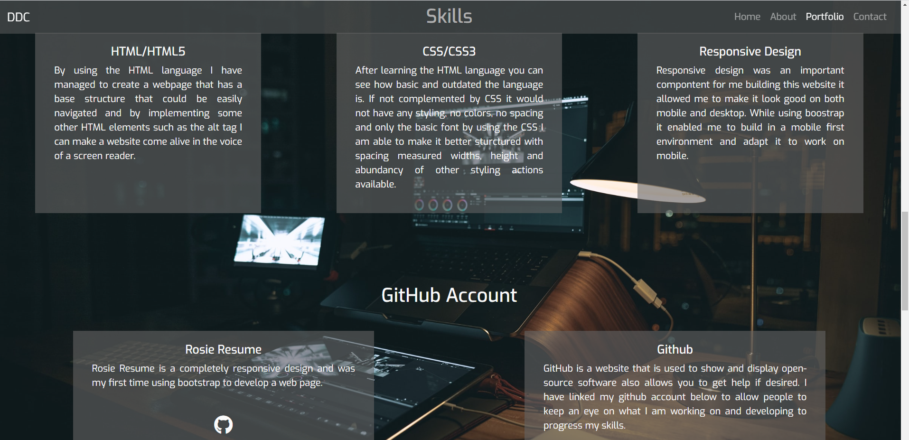

# Darren Daly Carolan Personal Portfolio
## Purpose

This is my submission for milestone one of code institute Full Stack software development course.

I have done a personal resume for this submission. To display to employers my skills and expertise in such 
development languages as HTML and CSS while using wireframes to develop the layout and structure while taking
UX in to account.

## Active link
A live version of my personal [portfolio](https://darrendc-dev.github.io/darrendc-first-milestone/#home)

# User Expierence( UX )

This is a demonstration of Darren's abilities and skills to be able to create a fully functional personal resume
as a portfolio piece while making it easily navagated by first time users and returning users a like.

## 5 Planes of UX

#### Strategy
My hope in doing this design was to create a platform on which navigation and content would be a
key priority for both returning and first time users.

#### Scope
With the hope of attracting more possible employers to my resume I designed it to allow first time
users easy access to my skills, previous project and my social links with a downloadable CV. While
allowing returning users ease of access to contact info.

#### Structure
With Structure in mind I wanted a progressive flow of information from the start to the contact phase
starting with the about section and rolling into my skills and previous work finishing with the option
of contacting me by email or social media.

#### Skeleton
While using balsamiq wireframe tools I made the ideal layout and color scheme I was hoping to achieve
while doing a multi-page layout but soon changed to a single page design.

#### Surface
The series of images set as my background were chosen in order of telling a visual story of the hard
work required for this line of employment. I tried to focus on the contrast between the text color 
and the images by going from a dark background towards a bright foreground.

## Users Expierences

#### Private Business
As Business owner looking for a web developer I found the information that Darren layed out very well 
organised and the website easy to navigate. While still having a fluid layout without compromising on
colors or content.

#### Recruiting Company
As a recruitment officer I expect to find information on Darren's skills and contact information while also getting
downloadable CV. My first expierence of Darren's resume was very quick and caused no confusion in finding
the information I needed.

# Validator
When coming to the end of my personal resume I validated my CSS and HTML using the asked validators

# Testing

# Deployment

# Future Ideas
### Increasing Project Count
I designed the portfolio section in such a way that i can always expand when I move on to more advanced
projects allowing for a greater show of my progression in the software development field.

# Websites and Services Used

# Credits
