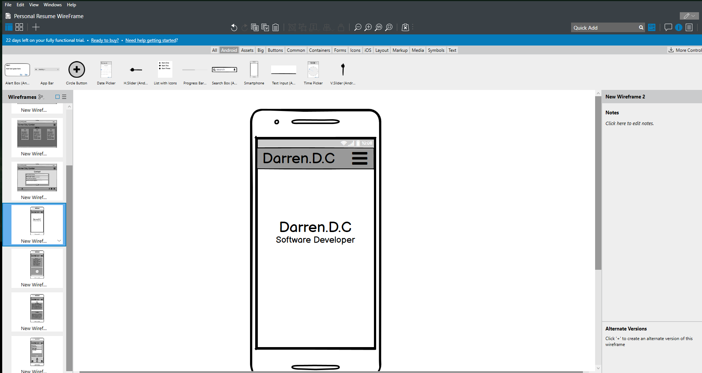

# Darren Daly Carolan Personal Portfolio
## Purpose

This is my submission for milestone one of code institute Full Stack software development course.

I have done a personal resume for this submission. To display to employers my skills and expertise in such 
development languages as HTML and CSS while using wireframes to develop the layout and structure while taking
UX in to account.

## Active link
A live version of my personal [portfolio](https://darrendc-dev.github.io/darrendc-first-milestone/#home)

# User Expierence( UX )

This is a demonstration of Darren's abilities and skills to be able to create a fully functional personal resume
as a portfolio piece while making it easily navagated by first time users and returning users a like.

## 5 Planes of UX

#### Strategy
My hope in doing this design was to create a platform on which navigation and content would be a
key priority for both returning and first time users.

#### Scope
With the hope of attracting more possible employers to my resume I designed it to allow first time
users easy access to my skills, previous project and my social links with a downloadable CV. While
allowing returning users ease of access to contact info.

#### Structure
With Structure in mind I wanted a progressive flow of information from the start to the contact phase
starting with the about section and rolling into my skills and previous work finishing with the option
of contacting me by email or social media.

#### Skeleton
While using balsamiq wireframe tools I made the ideal layout and color scheme I was hoping to achieve
while doing a multi-page layout but soon changed to a single page design.

#### Surface
The series of images set as my background were chosen in order of telling a visual story of the hard
work required for this line of employment. I tried to focus on the contrast between the text color 
and the images by going from a dark background towards a bright foreground.

## Users Expierences

#### Private Business
As Business owner looking for a web developer I found the information that Darren laid out very well 
organised and the website easy to navigate. While still having a fluid layout without compromising on
colours or content.

#### Recruiting Company
As a recruitment officer I expect to find information on Darren's skills and contact information while also getting
downloadable CV. My first expierence of Darren's resume was very quick and caused no confusion in finding
the information I needed.

# Development
1. I started with making out a wireframe.
2. I moved on to github to create a repository for version control.
3. I used the gitpod ide along with bootstrap to develop the basis of my Portfolio/Project.
4. I implemented boostraps grid system to allow for minor Responsive design working from mobile first design and up.
5. I then moved on to make a custom CSS file to allow for extra options when doing later responsive design changes.

# Validator
When coming to the end of my personal resume I validated my CSS and HTML using the required validators
and fixed any issues that presented. I had one warning on my HTML and could not resolve due to the structure of my coding.

# Testing
The testing expierence consisted of a few different stages

## Responsive design
While doing the responsive design testing I found out that my personal image on my about section would
not space properly on the iphone 5 but would work perfectly on iphone X and above I found out that
the padding was inherited to my image element and was causing many issues with display. I fixed the 
problem by giving the image a margin of 0 with the media command.

## Low mobile performance on lighthouse
While testing I found out about the lighthouse feature of google dev tools and when I was talking to my
mentor he advised using a lower resolution picture for the mobile design version to allow for better performance
so I done a bit of research and implemented a media command allowing it to load a lower resolution version of the
same picture to speed up perforamance. After doing further testing it did not help because the file size was still to
large to impact the performance. I will come back and fix when I learn more options to help resolve this issue.

# Deployment
My Project is deployed using GitHub pages and is updated when I push from Gitpod after commiting all the changes.

I was also using a web browser preview command in the cli by typing "python3 -m http.server"

# Future Ideas
### Increasing Project Count
I designed the portfolio section in such a way that i can always expand when I move on to more advanced
projects allowing for a greater show of my progression in the software development field.

### Including more advanced javaScript
I would like to go back and redo some of the webpage when I learn more javascript to implement
more advanced javaSctipt features for example adding slideshows and moving components.

# Websites and Services Used
Background Photos were all gotten off of https://unsplash.com/

All the information I required on getting the  scrollSpy navigation tool to work was gotten off of https://getbootstrap.com/docs/4.0/components/scrollspy/

The Exo Font family was imported from https://fonts.google.com/

I also used https://stackoverflow.com/ to help when I encountered issues, reading old question and answers would always lead me to things that might be causing the issue i.e. syntax issues

# Credits
I would like to give Roman my in-class tutor a big thanks for helping me
resolve some minor issues never giving me the answer but leading me in the
right direction.

I would also like to thank my mentor Guido for the some of the ideas such as
the scrollspy funtion in bootstrap to allow for more seamless navigation.